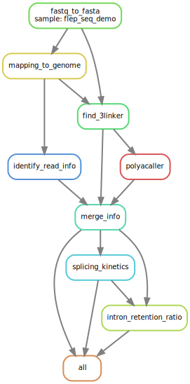

# FLEP-seq Pipeline

FLEP-seq (full-length elongating and polyadenylated RNA sequencing) allows calculation of the kinetics of cotranscriptional splicing and detects polyadenylated transcripts with unspliced introns retained at specific positions posttranscriptionally.

This pipeline includes basecalling and preprocessing of the FLEP-seq data. 

## Software and package requirements

* Minimap2 (https://github.com/lh3/minimap2)
* SAMtools (http://www.htslib.org/)
* BLAST+ (https://ftp.ncbi.nlm.nih.gov/blast/executables/blast+/LATEST/) (require for Nanopore data analysis)
* Python 3.7 or above, and following packages:
  * Pysam (https://github.com/pysam-developers/pysam)
  * ont_fast5_api (https://github.com/nanoporetech/ont_fast5_api)
  * pandas (https://pandas.pydata.org/)
  * NumPy (https://numpy.org/)
  * Matplotlib (https://matplotlib.org/)
  * Joblib (https://github.com/joblib/joblib)
  * click (https://click.palletsprojects.com/en/7.x/)
* R 3.5.2 or above, and following packages:
  * Tidyverse (https://www.tidyverse.org/)
  * optparse (https://cran.r-project.org/web/packages/optparse/index.html)


## Inputs

| File format | Information contained in file | File description | 
|---------- |---------- |---------- |
| fast5 | nanopore raw signal | The standard sequencing output for Oxford Nanopore sequencers | 

## Output
| File format | Information contained in file | File description |
|---------- |---------- |---------- |
| sequencing_summary.txt | basecalling summery file | Ooutput of Guppy basecaller |
| fastq | long-read fastq file | Read pass the quality threshold |
| *.read.info.txt | long-read fastq file | Generated by `merge_read_info.R` |
| *.read.splicing_kinetics.pdf | splicing kinetics | Generated by `plot_intron_splicing_kinetics.R` |

## Step by step workflow



1.	Nanopore basecalling

You can use MinKNOW to perform real-time basecalling while sequencing, or use the GPU version of Guppy to speed up basecalling after sequencing. Both MinKNOW and Guppy are available via Nanopore community site (https://community.nanoporetech.com). Command-line for running Guppy basecalling is as follow:

```
$ guppy_basecaller -i raw_fast5_dir -s out_fast5_dir -c dna_r9.4.1_450bps_hac.cfg --recursive --fast5_out --disable_pings --qscore_filtering --device "cuda:all:100%"
```

2.	Convert FASTQ files to FASTA format

```
$ python fastqdir2fasta.py --indir path/to/fastq_pass --out all.fasta
```

3.	Use minimap2 to map reads to reference genome

```
$ minimap2 -ax splice --secondary=no genome.fasta all.fasta > tmp.sam
```

CAUTION: For the organisms with short introns, such as Arabidopsis, it might be better to use the parameter “-G” to set the max intron length, for example, “-G 12000”. You also can set “-t number_of_threads” to use more threads to speed up.

```
$ samtools sort -o mapped.bam tmp.sam
$ samtools index mapped.bam
$ rm tmp.sam
```

4.	(Optional) Remove rRNA and tRNA derived reads

```
$ python filter_rRNA_bam.py --inbam mapped.bam --inbed rRNAtRNAetc.bed --out clean.bam
$ samtools index clean.bam
```

5.	Find 3’ adapter in reads

```
$ python adapterFinder.py --inbam clean.bam --inseq all.fasta --out adapter.result.txt --threads 36
```

6.	Identify polyA tail and estimate its length

```
$ python PolyACaller.py --inadapter adapter.result.txt --summary sequencing_summary.txt --fast5dir fast5_dir --out polyA_tail.result.txt --threads 36
```

7.	Extract read information

This pipeline will produce a table containing intron retention information and Pol II position.

```
$ python extract_read_info.py --inbam clean.bam --inbed lib/exon_intron_pos.repr.bed --out read_info.result.txt
```

8.	Merge the above analysis results

```
$ Rscript merge_read_info.R --type Nanopore --inreadinfo read_info.result.txt --inadapter adapter.result.txt --inpolya polyA_tail.result.txt --out read.info.txt
```

9.	Analyze splicing kinetics

```
$ python prepare_data_for_splice_kinetics.py --inreadinfo read.info.txt --inbed lib/exon_intron_pos.repr.bed --out read.intron.pos.splicing.txt
$ Rscript plot_intron_splicing_kinetics.R --inrelpos read.intron.pos.splicing.txt --inreadinfo read.info.txt --inintron lib/select_introns.txt --out read.splicing_kinetics.txt --pdf read.splicing_kinetics.pdf 
```

10.	Calculate intron retention ratio of polyadenylated transcripts

```
$ Rscript cal_polya_transcript_ir.R --inrelpos read.intron.pos.splicing.txt --inreadinfo read.info.txt --outrna mRNA.incompletely_spliced_ratio.txt --outintron intron.unspliced_ratio.txt
```

## File details

```
.
├── aligned_data
│   ├── flep_seq_demo.adapter.result.txt
│   ├── flep_seq_demo.polyA_tail.result.txt
│   ├── flep_seq_demo.read_info.result.txt
│   ├── flep_seq_demo.sorted.bam
│   └── flep_seq_demo.sorted.bam.bai
├── basecalled_data
│   └── flep_seq_demo.fasta
├── config.yml
├── genome_data
│   ├── exon_intron_pos.repr.bed
│   ├── rRNAtRNAetc.bed
│   └── select_introns.txt
├── guppy_out
├── pipeline.svg
├── README.md
├── requirements.txt
├── results
│   ├── flep_seq_demo.read.info.txt
│   ├── flep_seq_demo.read.intron.ir.stat
│   ├── flep_seq_demo.read.intron.pos.splicing.txt
│   ├── flep_seq_demo.read.rna.ir.stat
│   ├── flep_seq_demo.read.splicing_kinetics.pdf
│   └── flep_seq_demo.read.splicing_kinetics.txt
├── script
│   ├── adapterFinder.py
│   ├── ASCaller.py
│   ├── cal_polya_transcript_ir.R
│   ├── extract_read_info.generate_seq.py
│   ├── extract_read_info.py
│   ├── fastqdir2fasta.py
│   ├── filter_rRNA_bam.py
│   ├── lima_bam2fasta.py
│   ├── merge_read_info.R
│   ├── merge_sequencing_summary.py
│   ├── pacbio_find_polyA.py
│   ├── plot_intron_splicing_kinetics.R
│   ├── PolyACaller.py
│   ├── prepare_data_for_splice_kinetics.py
│   ├── run_guppy2.sh
│   ├── run_nanoplot.sh
│   ├── run_toulligqc.sh
│   └── split_files_into_dirs.py
└── snakefile
```

## Demo data

The demo data is available at figshare:

https://doi.org/10.6084/m9.figshare.20217632.v1

## References

Long, Y., Jia, J., Mo, W. et al. FLEP-seq: simultaneous detection of RNA polymerase II position, splicing status, polyadenylation site and poly(A) tail length at genome-wide scale by single-molecule nascent RNA sequencing. Nat Protoc 16, 4355–4381 (2021). https://doi.org/10.1038/s41596-021-00581-7

Jia, J., Long, Y., Zhang, H. et al. Post-transcriptional splicing of nascent RNA contributes to widespread intron retention in plants. Nat. Plants 6, 780–788 (2020). https://doi.org/10.1038/s41477-020-0688-1